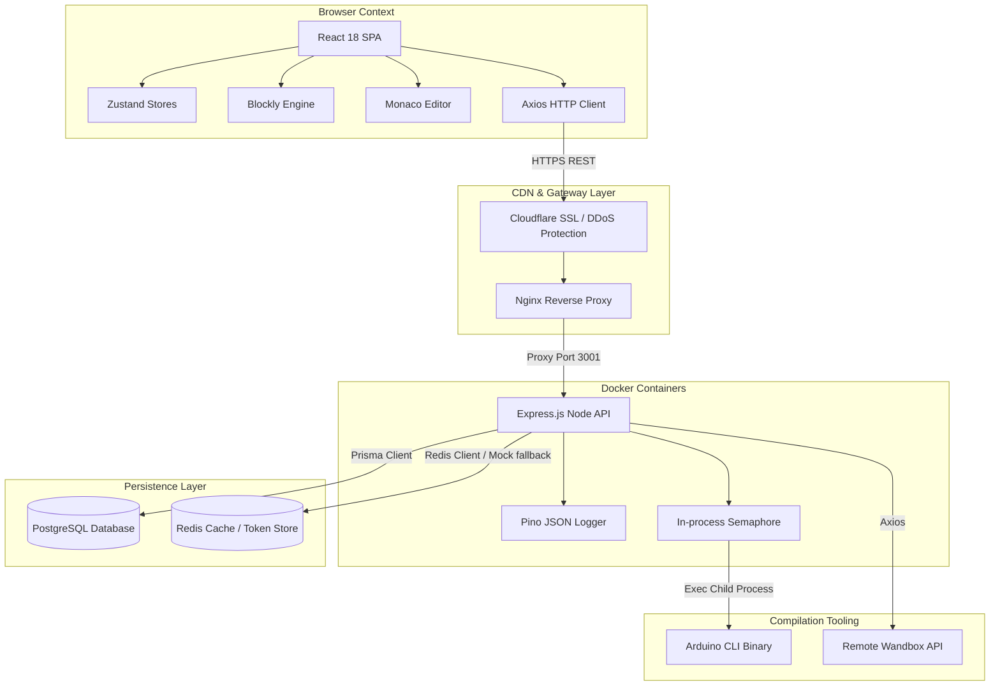
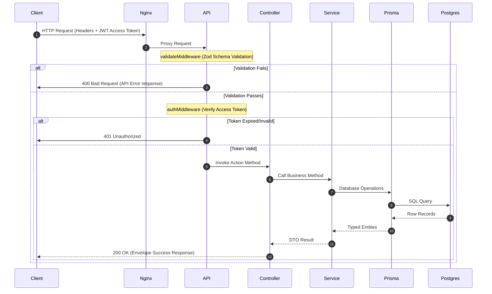
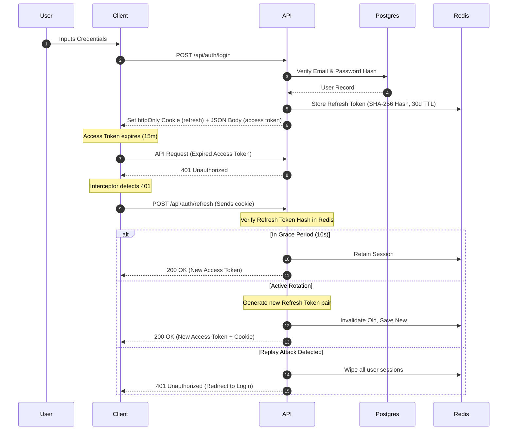
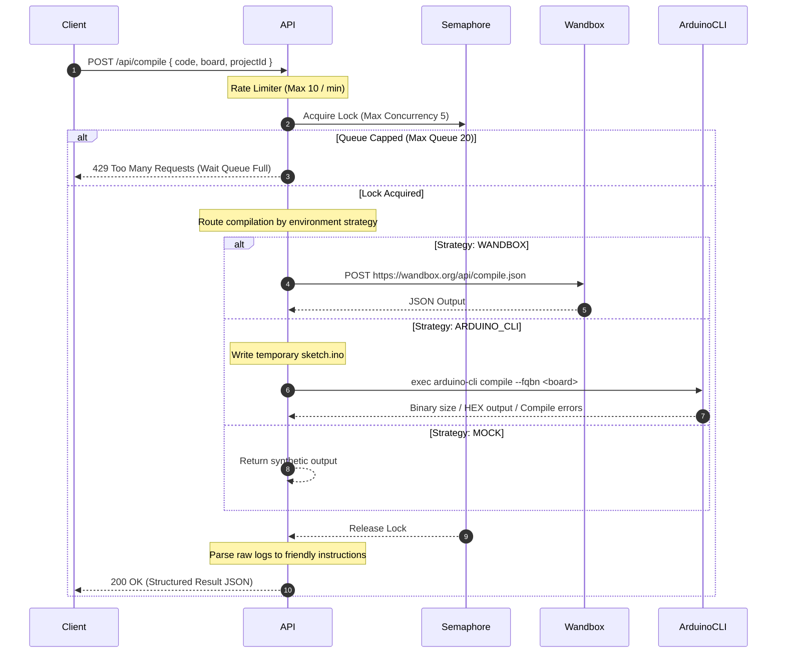
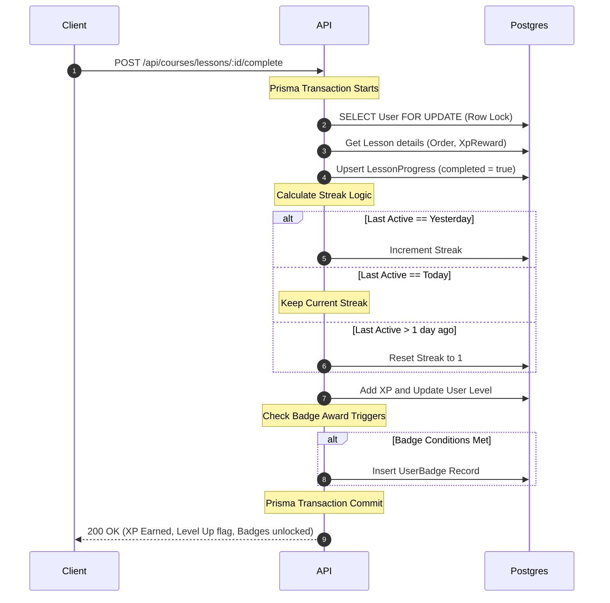
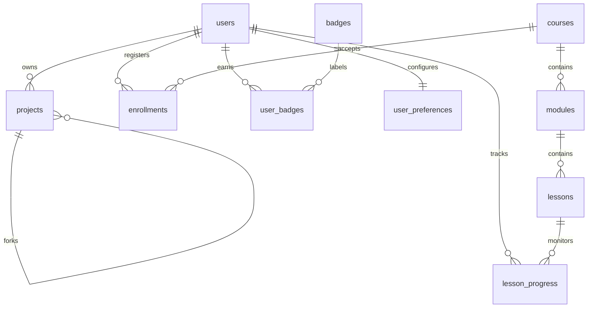
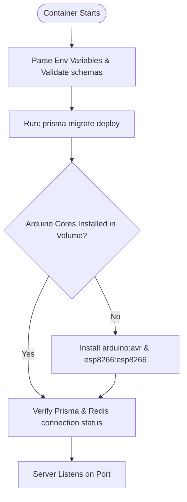

# 🚀 Tinkergyan — Enterprise Embedded Coding Education Platform

Tinkergyan is a full-stack, child-friendly, multi-tenant-ready embedded systems learning platform designed to teach kids and beginners (ages 10–18) the fundamentals of hardware programming. The monorepo integrates visual drag-and-drop block coding (Google Blockly), an advanced text editor (Monaco), real-time compilation execution engines (via remote Wandbox or local Arduino CLI), a gamified Learning Management System (LMS) with XP and badges, and a custom interactive canvas-based simulator.

---

## 🗺️ Table of Contents

1. [Project Overview](#1-project-overview)
2. [Complete Technology Stack](#2-complete-technology-stack)
3. [System Architecture](#3-system-architecture)
4. [Complete System Design](#4-complete-system-design)
5. [Folder Structure](#5-folder-structure)
6. [Module Documentation](#6-module-documentation)
7. [API Documentation](#7-api-documentation)
8. [Authentication System](#8-authentication-system)
9. [Authorization & Security Guards](#9-authorization--security-guards)
10. [Database Documentation](#10-database-documentation)
11. [Business Logic & Service Layer](#11-business-logic--service-layer)
12. [Request Lifecycle](#12-request-lifecycle)
13. [Startup Lifecycle](#13-startup-lifecycle)
14. [Environment Variables](#14-environment-variables)
15. [Docker Documentation](#15-docker-documentation)
16. [Deployment Guide](#16-deployment-guide)
17. [Logging](#17-logging)
18. [Error Handling](#18-error-handling)
19. [Validation](#19-validation)
20. [Security Audits & Mitigations](#20-security-audits--mitigations)
21. [Performance Optimizations](#21-performance-optimizations)
22. [Cron Jobs](#22-cron-jobs)
23. [Background Jobs](#23-background-jobs)
24. [File Storage](#24-file-storage)
25. [External Integrations](#25-external-integrations)
26. [Configuration Files](#26-configuration-files)
27. [Code Flow Walkthroughs](#27-code-flow-walkthroughs)
28. [Development Guide](#28-development-guide)
29. [Troubleshooting](#29-troubleshooting)
30. [Frequently Asked Questions (FAQ)](#30-frequently-asked-questions-faq)
31. [Future Improvements](#31-future-improvements)
32. [Appendix](#32-appendix)

---

## 1. Project Overview

Tinkergyan lowers the barrier of entry for physical computing by addressing the gap between visual blocks (Scratch-like) and real-world microcontrollers (Arduino/ESP8266/ESP32). It translates visual blocks into clean, compilable C++ code in real-time, compiles this code in a secure sandbox, and parses compiler warnings/errors into encouraging, gamified instructions tailored for young minds.

### Feature Matrix

| Feature                       | Description                                                                                                    | Target Audience Value                                                    | Implementation Status |
| :---------------------------- | :------------------------------------------------------------------------------------------------------------- | :----------------------------------------------------------------------- | :-------------------- |
| **Visual Block Editor**       | Custom Blockly category mappings representing digital/analog I/O, delays, variables, and serial communication. | Simplifies logic building without syntax errors.                         | Fully Implemented     |
| **C++ Monaco Editor**         | Full text editor with syntax highlighting, inline warning decoration, and configuration settings.              | Smooth transition from blocks to real-world code.                        | Fully Implemented     |
| **Three-Tier Compile Engine** | Switch-based compiler routing through Wandbox (remote GCC), local Arduino CLI binary, or Mock compiler.        | High resilience compiling across local, containerized, and cloud setups. | Fully Implemented     |
| **Interactive Simulator**     | Canvas-based Framer Motion rendering of boards and sprites for virtual test execution.                         | Learn coding without having physical hardware nearby.                    | Fully Implemented     |
| **LMS System**                | Courses → Modules → Lessons structure. Tracks completion, streak logic, and points.                            | Structured, gamified curriculum to guide the user.                       | Fully Implemented     |
| **Playground & Gallery**      | Sandbox for custom projects with sharing toggle, template forks, and public showcase.                          | Promotes collaboration and self-directed creation.                       | Fully Implemented     |
| **Gamification Core**         | XP levels (`XP_100`), daily streak calculations, and automatic badges triggers.                                | Enhances engagement and retention.                                       | Fully Implemented     |

---

## 2. Complete Technology Stack

| Layer              | Component         | Technology Used       | Reason for Selection & Operational Context                                       |
| :----------------- | :---------------- | :-------------------- | :------------------------------------------------------------------------------- |
| **Frontend**       | Core Framework    | React 18 + TypeScript | Component-driven UI, rigid type-safety bounds across state.                      |
| **Frontend**       | Build Tool        | Vite                  | Ultra-fast Hot Module Replacement (HMR) and roll-up bundle split.                |
| **Frontend**       | Styling           | Tailwind CSS          | Utility-first styling enabling fast styling cycles under strict constraints.     |
| **Frontend**       | Animation         | Framer Motion         | Fluid spring physics and animations for the simulator interface.                 |
| **Frontend**       | State Manager     | Zustand               | Lightweight state stores separating local UI states from business logic.         |
| **Frontend**       | Visual Editor     | Google Blockly        | Robust visual block editor with flexible custom generators.                      |
| **Frontend**       | Text Editor       | Monaco Editor         | The VS Code editing engine, providing syntax highlighting and formatting.        |
| **Frontend**       | HTTP Client       | Axios                 | Custom interceptors handling JWT authorization headers and silent refresh loops. |
| **Backend**        | Core Framework    | Express.js (Node.js)  | Standard web server API foundation, using custom async catch wrapper wrappers.   |
| **Backend**        | Language          | TypeScript            | Prevents compile-time mismatches between api payloads and entities.              |
| **Backend**        | ORM               | Prisma ORM            | Automated schema migrations, type-safe queries, client generation.               |
| **Backend**        | Primary DB        | PostgreSQL 15+        | Relational schema integrity, composite index optimization.                       |
| **Backend**        | Caching / Session | Redis                 | High-speed cache for session data, token tracking, and rate limit counters.      |
| **Backend**        | Logging           | Pino / Pino-HTTP      | Structured JSON logging supporting context tracking.                             |
| **Backend**        | Compilation CLI   | Arduino CLI           | Command-line tool used to index, update, build, and link C++ targets.            |
| **Infrastructure** | Containerization  | Docker                | Isolates API processes and manages compiler environment state.                   |
| **Infrastructure** | Reverse Proxy     | Nginx / Cloudflare    | Directs root static file streams, terminates SSL, and guards endpoints.          |
| **Infrastructure** | Monorepo Engine   | Turborepo / pnpm      | Centralized task caching, zero-dependency symlinking.                            |

---

## 3. System Architecture

Tinkergyan is organized as a multi-tier system split between a single-page app (SPA) frontend and a RESTful backend API, backed by a relational database and a caching layer. The workspace packages use **pnpm workspaces** for sharing TypeScript definitions seamlessly between components.



---

## 4. Complete System Design

This section maps out key workflow processes and sequence flows within the system.

### 4.1 Request-Response Pipeline



### 4.2 Authentication Lifecycle & Rotation



### 4.3 Compilation Pipeline



### 4.4 Lesson Completion Workflow



---

## 5. Folder Structure

Below is the verified structure of the Tinkergyan monorepo:

```
tinkergyan/
├── apps/
│   ├── api/                    # Express Backend API
│   │   ├── prisma/             # Schema definitions, seed files, migrations
│   │   │   ├── migrations/     # Database migration scripts (PostgreSQL)
│   │   │   └── seed.ts         # Seeding files (Courses, Modules, Lessons, Badges)
│   │   ├── src/
│   │   │   ├── controllers/    # API request route handlers
│   │   │   ├── errors/         # Custom exceptions and error codes
│   │   │   ├── lib/            # Library integrations (Arduino, Semaphore, Prisma, Redis)
│   │   │   ├── middleware/     # Auth checks, validation middleware, and global error catches
│   │   │   ├── routes/         # Router configuration maps
│   │   │   ├── services/       # Core business logic handlers
│   │   │   ├── utils/          # CatchAsync and helper functions
│   │   │   ├── app.ts          # Express App configuration
│   │   │   ├── env.ts          # Environment variables parsing and validation
│   │   │   └── server.ts       # Application runner listening on target port
│   │   ├── package.json
│   │   ├── start.sh            # Production entry point running migrations and caching cores
│   │   └── tsup.config.ts      # Builder orchestrating ES module packing
│   │
│   └── web/                    # React SPA Frontend
│       ├── src/
│       │   ├── components/
│       │   │   ├── editor/         # Workspace, Monaco, Console, Blockly toolbox code generators
│       │   │   │   └── simulator/  # Canvas simulators, sprite lists, sprite details
│       │   │   ├── layout/         # Navigation bars, Sidebar menu elements
│       │   │   └── ui/             # Reusable atomic UI elements (Buttons, Loaders, Toasts)
│       │   ├── pages/              # View components mapped to React Router paths
│       │   ├── services/           # Axios HTTP endpoints wrappers
│       │   ├── stores/             # Zustand stores (Auth, Editor, Projects, UI states)
│       │   ├── index.css           # Global stylesheets integrating design system colors
│       │   └── main.tsx            # Web entry file mapping root routes
│       ├── package.json
│       ├── tailwind.config.ts      # Custom Tailwind styling overrides
│       ├── vercel.json             # Rewrite mapping configuration
│       └── vite.config.ts          # Vite build task configurations
│
├── packages/
│   └── shared-types/           # Shared Type Definitions
│       ├── src/
│       │   ├── api.ts              # API envelopes, responses, and error definitions
│       │   ├── auth.ts             # Auth login, register, and refresh schemas
│       │   ├── common.ts           # Themes, roles, levels, targets, outcomes
│       │   ├── compile.ts          # Compilation request payload schemas
│       │   └── entities.ts         # User, Project, Lesson, Course models interfaces
│       ├── package.json
│       └── tsconfig.json
│
├── .github/
│   └── workflows/
│       ├── ci.yml              # Build checks, type-safety testing, linting
│       └── deploy.yml          # Production deployment triggers sending code to the VPS via SSH
│
├── Dockerfile                  # Multi-stage container production build script
├── docker-compose.yml          # Local container development runner
├── package.json                # Monorepo configuration
├── pnpm-workspace.yaml         # PNPM workspace registry
└── turbo.json                  # Turborepo task pipeline management
```

---

## 6. Module Documentation

### 6.1 Core Compiler Module (`apps/api/src/lib/compiler.ts`)

- **Purpose**: High-level routing orchestrating source code validation and target compiler actions.
- **Responsibilities**:
  1. Checks strategy configuration (Wandbox remote, local Arduino CLI, Mock mode).
  2. Spawns processes securely using rate boundaries.
  3. Maps native compiler standard error signals back to logical line/column blocks.
- **Dependencies**: `arduino-shim.ts`, `compile-semaphore.ts`, `@prisma/client`.
- **Database Tables**: Reads `Project` meta to determine compilation limits.

### 6.2 Authentication Module (`apps/api/src/services/auth.service.ts`)

- **Purpose**: Registers, validates, tracks, and cleans user session state.
- **Responsibilities**:
  1. Generates short-lived Access JWTs and long-lived session Refresh Tokens.
  2. Rotates tokens, checks grace-period logs, and flags session hijacks.
  3. Secures user credentials using `bcrypt` (12 rounds).
- **Dependencies**: Redis clients, Jose signature libraries.
- **Database Tables**: Reads/Writes `users` table.

### 6.3 LMS Module (`apps/api/src/services/course.service.ts`)

- **Purpose**: Governs modules, tracks progress, and calculates achievements.
- **Responsibilities**:
  1. Evaluates user completion events atomically.
  2. Runs daily calculations to maintain streaks.
  3. Fires background events triggering user rewards.
- **Dependencies**: `badge.service.ts`, Prisma transaction locks.
- **Database Tables**: `courses`, `modules`, `lessons`, `lesson_progress`, `users`.

---

## 7. API Documentation

### 7.1 Auth Routes (`/api/auth`)

#### `POST /api/auth/register`

- **Authentication**: None.
- **Zod Validation Schema**:
  ```typescript
  z.object({
    name: z.string().min(2).max(50),
    email: z.string().email(),
    password: z.string().min(8),
  });
  ```
- **Request Body**:
  ```json
  {
    "name": "Jane Doe",
    "email": "jane@example.com",
    "password": "Password123"
  }
  ```
- **Success Response (201 Created)**:
  ```json
  {
    "success": true,
    "data": {
      "user": {
        "id": "cm01234567890abcdefgh",
        "name": "Jane Doe",
        "email": "jane@example.com",
        "avatar": null,
        "xp": 0,
        "level": 1,
        "role": "USER"
      },
      "accessToken": "eyJhbGciOiJIUzI1NiIsInR5cCI6IkpXVCJ9..."
    }
  }
  ```
- **Error Responses**:
  - `400 Bad Request`: Validation errors.
  - `409 Conflict`: Email already in use (`CONFLICT`).

#### `POST /api/auth/login`

- **Authentication**: None.
- **Request Body**:
  ```json
  {
    "email": "jane@example.com",
    "password": "Password123"
  }
  ```
- **Success Response (200 OK)**:
  - Sets httpOnly cookie `refreshToken`.
  - Body:
    ```json
    {
      "success": true,
      "data": {
        "user": {
          "id": "cm01234567890abcdefgh",
          "name": "Jane Doe",
          "email": "jane@example.com",
          "avatar": null,
          "xp": 0,
          "level": 1,
          "role": "USER"
        },
        "accessToken": "eyJhbGciOiJIUzI1NiIsInR5cCI6IkpXVCJ9..."
      }
    }
    ```

#### `POST /api/auth/refresh`

- **Authentication**: Valid `refreshToken` cookie.
- **Success Response (200 OK)**: Sets a rotated `refreshToken` cookie and returns a new short-lived access token.

#### `POST /api/auth/logout`

- **Authentication**: Valid `refreshToken` cookie.
- **Success Response (200 OK)**: Clears the `refreshToken` cookie and deletes the active session from Redis.

---

### 7.2 Compile Routes (`/api/compile`)

#### `POST /api/compile`

- **Authentication**: Required (`requireAuth`).
- **Request Body**:
  ```json
  {
    "code": "void setup() { pinMode(13, OUTPUT); } void loop() { digitalWrite(13, HIGH); }",
    "board": "arduino:avr:uno",
    "projectId": "cm11223344"
  }
  ```
- **Success Response (200 OK)**:
  ```json
  {
    "success": true,
    "data": {
      "output": "Sketch uses 444 bytes (1%) of program storage space. Maximum is 32256 bytes.\nGlobal variables use 9 bytes (0%) of dynamic memory.",
      "warnings": [],
      "compiledAt": "2026-07-02T10:41:45.000Z",
      "durationMs": 850
    }
  }
  ```
- **Error Response (400 Bad Request / Compile Error)**:
  ```json
  {
    "success": false,
    "error": {
      "code": "COMPILE_ERROR",
      "message": "Compilation failed",
      "details": [
        {
          "line": 2,
          "column": 15,
          "message": "expected ';' before '}' token",
          "type": "error"
        }
      ]
    }
  }
  ```

---

### 7.3 Course Routes (`/api/courses`)

#### `GET /api/courses`

- **Authentication**: Optional (`optionalAuth`).
- **Success Response (200 OK)**:
  ```json
  {
    "success": true,
    "data": {
      "courses": [
        {
          "id": "course-id-1",
          "slug": "arduino-basics",
          "title": "Introduction to Arduino",
          "description": "Learn visual coding with Arduino",
          "difficulty": "BEGINNER",
          "moduleCount": 3,
          "lessonCount": 9,
          "enrollmentCount": 142,
          "isEnrolled": true
        }
      ]
    }
  }
  ```

#### `POST /api/courses/lessons/:id/complete`

- **Authentication**: Required.
- **Success Response (200 OK)**:
  ```json
  {
    "success": true,
    "data": {
      "alreadyCompleted": false,
      "xpAwarded": 10,
      "totalXp": 150,
      "levelUp": false,
      "badgesEarned": []
    }
  }
  ```

---

## 8. Authentication System

Tinkergyan implements a hybrid JWT-and-Session model designed for maximum API statelessness and session security.

### Token Lifecycle

1. **Access Token**: An HS256-signed JSON Web Token containing the user's ID, email, and role. Signed by the server using `jose` with a **15-minute expiration time**. Stored strictly in-memory (Zustand state) to protect against XSS extraction.
2. **Refresh Token**: An 80-character cryptographically secure hex string (`crypto.randomBytes(40)`). Transmitted as an `httpOnly`, `Secure`, `SameSite=Strict` cookie, preventing client-side access. Stored in Redis as a SHA-256 hash mapped to user metadata with a **30-day TTL**.

### Token Rotation and Session Hijack Guard

- On every `/auth/refresh` request, the server validates the current Refresh Token, deletes it, and issues a new one.
- **Grace Period**: To handle concurrent requests (e.g. React double-mounting or race conditions), the old Refresh Token remains valid \for a **10-second grace period** from its rotation time.
- **Breach Detection**: If a rotated Refresh Token is used _after_ the 10-second grace period, the server flags it as a replay attack (session hijack). The server immediately deletes the entire session history for that user from Redis, invalidating all outstanding tokens and forcing a full re-authentication.

```
[Client Refresh Call] ──> Match DB Hash ──> Rotated?
                                │
                 ┌──────────────┴──────────────┐
                 ▼ (No)                        ▼ (Yes)
           Rotate Tokens                  Inside 10s Grace?
         Set New Cookie                        ┌───┴───┐
                                               ▼ (Yes)   ▼ (No)
                                             Allow JWT   Breach Flag! Clear All User Sessions
```

---

## 9. Authorization & Security Guards

Tinkergyan enforces access control at the route level using Express middlewares and at the service level using ownership checks.

### Middleware Matrix

| Middleware     | Target Routes                                 | Behavior                                                                                                                                                     |
| :------------- | :-------------------------------------------- | :----------------------------------------------------------------------------------------------------------------------------------------------------------- |
| `optionalAuth` | `GET /courses`, `GET /courses/:slug`          | Extracts JWT if present in the `Authorization` header to populate user details (like enrollment status) but does not block requests if the token is missing. |
| `requireAuth`  | `POST /compile`, `/projects/*`, `/users/me/*` | Rejects the request with a `401 Unauthorized` response code if a valid Access Token is not provided in the `Authorization` header.                           |
| `validate`     | All modifying endpoints                       | Accepts a Zod schema, validates `req.body`, `req.query`, or `req.params`, and halts processing with a `400 Validation Error` if schemas do not match.        |

### Domain Ownership Enforcement

All modifying services check entity ownership explicitly in code:

```typescript
// apps/api/src/services/project.service.ts
async findOne(id: string, userId: string) {
  const project = await this.prisma.project.findUnique({ where: { id } });
  if (!project) throw new AppError(ErrorCodes.RESOURCE_NOT_FOUND, 'Project not found', 404);
  if (!project.isPublic && project.userId !== userId) {
    throw new AppError(ErrorCodes.FORBIDDEN, 'Access denied', 403);
  }
  return project;
}
```

---

## 10. Database Documentation

### Entity-Relationship Diagram (ERD)



### Table Schema and Fields Reference

#### Table: `users`

- **Primary Key**: `id` (`TEXT`, default CUID)
- **Fields**:
  - `name`: `TEXT` (NOT NULL)
  - `email`: `TEXT` (NOT NULL, UNIQUE)
  - `passwordHash`: `TEXT` (NOT NULL)
  - `avatar`: `TEXT` (NULLABLE)
  - `xp`: `INTEGER` (NOT NULL, DEFAULT 0)
  - `level`: `INTEGER` (NOT NULL, DEFAULT 1)
  - `streak`: `INTEGER` (NOT NULL, DEFAULT 0)
  - `lastActiveAt`: `TIMESTAMP` (DEFAULT CURRENT_TIMESTAMP)
- **Indexes**: `users_email_key` (UNIQUE), `users_xp_idx` (DESC) for leaderboards.

#### Table: `projects`

- **Primary Key**: `id` (`TEXT`, default CUID)
- **Fields**:
  - `userId`: `TEXT` (NOT NULL, FK → `users.id` ON DELETE CASCADE)
  - `title`: `TEXT` (NOT NULL)
  - `type`: `ProjectType` (`BLOCK` or `CODE`)
  - `code`: `TEXT` (NULLABLE)
  - `blockState`: `JSONB` (NULLABLE)
  - `boardTarget`: `TEXT` (DEFAULT `arduino:avr:uno`)
  - `isPublic`: `BOOLEAN` (DEFAULT `false`)
  - `forkCount`: `INTEGER` (DEFAULT 0)
  - `forkedFrom`: `TEXT` (NULLABLE, FK → `projects.id` ON DELETE SET NULL)
- **Indexes**: `projects_userId_idx`, `projects_isPublic_createdAt_idx` for public galleries.

#### Table: `lessons`

- **Primary Key**: `id` (`TEXT`, default CUID)
- **Fields**:
  - `moduleId`: `TEXT` (NOT NULL, FK → `modules.id` ON DELETE CASCADE)
  - `title`: `TEXT` (NOT NULL)
  - `content`: `TEXT` (NOT NULL, stores MDX text)
  - `type`: `LessonType` (`READING`, `CODING`, or `QUIZ`)
  - `starterCode`: `TEXT` (NULLABLE)
  - `order`: `INTEGER` (NOT NULL)
  - `xpReward`: `INTEGER` (DEFAULT 10)

#### Table: `lesson_progress`

- **Primary Key**: `id` (`TEXT`, default CUID)
- **Fields**:
  - `userId`: `TEXT` (NOT NULL, FK → `users.id` ON DELETE CASCADE)
  - `lessonId`: `TEXT` (NOT NULL, FK → `lessons.id` ON DELETE CASCADE)
  - `completed`: `BOOLEAN` (DEFAULT `false`)
  - `completedAt`: `TIMESTAMP` (NULLABLE)
- **Constraints**: UNIQUE index on `(userId, lessonId)`.

---

## 11. Business Logic & Service Layer

The backend uses a Service-Controller pattern to isolate database queries and business rules from express routing logic.

### 11.1 AuthService (`src/services/auth.service.ts`)

- **`register(data)`**: Validates duplicate email records, hashes password, saves the user record, triggers a starter template project, and provisions default user preferences.
- **`login(email, password)`**: Compares passwords, writes a hashed session token to Redis, and issues access/refresh tokens.
- **`refresh(token)`**: Evaluates Refresh Token hashes in Redis, enforces rotation, handles grace periods, and throws security alerts if reuse is detected.
- **`logout(token)`**: Removes session keys from Redis and clears the client's cookie.

### 11.2 ProjectService (`src/services/project.service.ts`)

- **`create(userId, input)`**: Inserts a new project, mapping defaults based on selected templates.
- **`update(id, userId, input)`**: Verifies owner privileges before applying partial code updates.
- **`fork(id, userId)`**: Clones a project inside a database transaction, updates the original project's `forkCount` atomically, and re-assigns ownership of the cloned project.

### 11.3 CourseService (`src/services/course.service.ts`)

- **`completeLesson(userId, lessonId)`**: Runs an interactive database transaction with row-level locks on the user record (`SELECT ... FOR UPDATE`). Inserts progress logs, computes level gains based on XP, evaluates streak windows, and awards achievement badges.
- **Level Calculation**: Level transitions are calculated deterministically:
  $$\text{Level} = \lfloor\sqrt{\frac{\text{XP}}{25}}\rfloor + 1$$
- **Streak Calculation**:
  - If the user's last activity was **exactly 1 day ago**, the streak is incremented.
  - If the user's last activity was **today**, the streak remains unchanged.
  - If the user's last activity was **more than 1 day ago**, the streak resets to 1.

---

## 12. Request Lifecycle

The diagram below details the path of an HTTP request through the system.

```
[Incoming Request]
       │
       ▼
 ┌───────────┐
 │   Nginx   │ (SSL termination, serves frontend SPA or forwards to backend)
 └─────┬─────┘
       │
       ▼
 ┌───────────┐
 │   CORS    │ (Checks origin against white-list domains)
 └─────┬─────┘
       │
       ▼
 ┌───────────┐
 │   Zod     │ (Verifies body, parameters, query syntax)
 └─────┬─────┘
       │
       ▼
 ┌───────────┐
 │   Auth    │ (Decodes JWT token, assigns user context to req.user)
 └─────┬─────┘
       │
       ▼
 ┌───────────┐
 │Controller │ (Extracts path values, routes payload to services)
 └─────┬─────┘
       │
       ▼
 ┌───────────┐
 │  Service  │ (Orchestrates queries, updates databases/caches)
 └─────┬─────┘
       │
       ▼
 ┌───────────┐
 │   Prisma  │ (Executes SQL transaction in PostgreSQL)
 └─────┬─────┘
       │
       ▼
 ┌───────────┐
 │CatchAsync │ (Catches unhandled promise rejections, routes to error handler)
 └─────┬─────┘
       │
       ▼
 ┌───────────┐
 │ GlobalErr │ (Formats uniform ApiErrorResponse envelopes)
 └───────────┘
```

---

## 13. Startup Lifecycle

On host launch or container restart, the backend runs a sequential startup routine:



---

## 14. Environment Variables

### 14.1 Backend Engine (`apps/api/.env`)

| Variable                   | Required? | Default       | Security Level | Purpose                                                               |
| :------------------------- | :-------- | :------------ | :------------- | :-------------------------------------------------------------------- |
| `PORT`                     | Optional  | `3001`        | Low            | Port number the backend server binds to.                              |
| `NODE_ENV`                 | Required  | `development` | Low            | Runtime mode (`development`, `production`, `test`).                   |
| `DATABASE_URL`             | Required  | -             | High           | PostgreSQL connection URL with credentials.                           |
| `REDIS_URL`                | Optional  | -             | High           | Redis connection URL. Falls back to in-memory maps if not configured. |
| `JWT_SECRET`               | Required  | -             | Critical       | Secret key for signing and verifying JWT Access Tokens.               |
| `JWT_EXPIRES_IN`           | Optional  | `15m`         | Low            | Expiration duration for Access Tokens.                                |
| `REFRESH_TOKEN_EXPIRES_IN` | Optional  | `30d`         | Low            | Expiration duration for Refresh Tokens.                               |
| `COMPILE_STRATEGY`         | Required  | `WANDBOX`     | Low            | Selected compilation strategy (`WANDBOX`, `ARDUINO_CLI`, `MOCK`).     |
| `COMPILE_CONCURRENCY`      | Optional  | `5`           | Low            | Max concurrent compilations.                                          |
| `COMPILE_MAX_QUEUE`        | Optional  | `20`          | Low            | Max queue depth before dropping requests.                             |
| `COMPILE_TIMEOUT_MS`       | Optional  | `30000`       | Low            | Compilation timeout threshold.                                        |

### 14.2 Frontend (`apps/web/.env`)

| Variable        | Required? | Default      | Purpose                               |
| :-------------- | :-------- | :----------- | :------------------------------------ |
| `VITE_API_URL`  | Optional  | `/api`       | Base API target url path.             |
| `VITE_APP_NAME` | Optional  | `Stemmantra` | Application name shown in title bars. |

---

## 15. Docker Documentation

Tinkergyan uses a multi-stage Docker build pipeline to generate optimized production images.

```
Stage 1: shared-builder (Root files, pnpm configs, installs workspace dependencies)
       │
       ▼
Stage 2: frontend-builder (Builds production assets for the React single-page app)
       │
       ▼
Stage 3: backend-builder (Compiles backend TypeScript files into standard ES modules)
       │
       ▼
Stage 4: runner (Final production container. Copies builds, installs arduino-cli, runs start.sh)
```

### Production Dockerfile (`/Dockerfile`)

The production Dockerfile is organized as follows:

- **`shared-builder`**: Copies root monorepo files, configures `pnpm`, and installs workspace dependencies using a frozen lockfile to ensure reproducible builds.
- **`frontend-builder`**: Runs Vite compilation pipelines to bundle public assets and compile React assets.
- **`backend-builder`**: Compiles backend TypeScript files using `tsup`.
- **`runner`**: The final production image. Installs the `arduino-cli` binary, copies compiled assets from previous stages, and exposes port `3001`. It runs `start.sh` to run database migrations, install Arduino/ESP8266 toolchains if missing from the volume, and start the Node process.

---

## 16. Deployment Guide

Tinkergyan is configured for deployment to a Linux VPS (Ubuntu 20.04/22.04) running Docker.

### 16.1 Continuous Deployment Flow (GitHub Actions)

Deployments are automated using the Production Deploy workflow (`.github/workflows/deploy.yml`):

1. **Trigger**: Pushes to the `main` branch trigger the deployment.
2. **Build and Check**: The CI workflow (`.github/workflows/ci.yml`) runs linting, formatting checks, typecheck tasks, and frontend builds.
3. **Deploy via SSH**: On successful validation, the runner establishes an SSH connection to the destination VPS, navigates to `/opt/tinkergyan`, pulls the latest code, and builds the container:
   ```bash
   docker compose build api
   docker compose up -d --no-deps --force-recreate api
   docker image prune -f
   ```

### 16.2 Required GitHub Repository Secrets

To enable automated deployments, configure these secrets in your repository settings:

- `VPS_HOST`: The public IP address or domain name of your VPS.
- `VPS_USER`: The username used for SSH access (e.g., `root` or `deploy`).
- `VPS_SSH_KEY`: The private SSH key matching the public key authorized on the VPS.
- `VPS_PORT`: The SSH port (typically `22`).

---

## 17. Logging

Structured logging is implemented using the `pino` library.

### Configuration

- **Development**: Logs are piped through `pino-pretty` to generate human-readable, colorized output.
- **Production**: Logs are output as structured JSON objects to standard output (`stdout`), making them easy to parse and ingest into log aggregation tools.
- **HTTP Requests**: Handled by the `pino-http` middleware, which logs the HTTP method, path, response status, duration, and user ID.

```json
{
  "level": 30,
  "time": 1773048000000,
  "pid": 12,
  "hostname": "api-container",
  "req": {
    "id": 1,
    "method": "POST",
    "url": "/api/compile",
    "headers": { "host": "localhost:3001" }
  },
  "userId": "cm0123456",
  "msg": "Processing compilation request"
}
```

---

## 18. Error Handling

### 18.1 Domain Error Base (`src/errors/app-error.ts`)

The API uses a custom `AppError` class that extends the native JavaScript `Error` object. This class attaches a standardized error code and HTTP status code to the error instance, allowing the global error handler to format consistent API error responses.

### 18.2 Global Error Handler Middleware (`src/middleware/error.middleware.ts`)

A centralized middleware catches all errors thrown during request processing. It formats them into a standard error response envelope, preventing internal database errors or stack traces from leaking to the client in production.

```json
{
  "success": false,
  "error": {
    "code": "RESOURCE_NOT_FOUND",
    "message": "The requested project could not be found.",
    "details": []
  }
}
```

### 18.3 Canonical Error Codes

The application defines a strict set of error codes shared between the frontend and backend:

- `VALIDATION_ERROR` (400): The request payload failed schema validation.
- `UNAUTHORIZED` (401): The request lacks valid authentication credentials.
- `FORBIDDEN` (403): The user does not have permission to access the resource.
- `RESOURCE_NOT_FOUND` (404): The requested resource does not exist.
- `CONFLICT` (409): A conflict occurred (e.g., email address already registered).
- `RATE_LIMITED` (429): The user has exceeded their request limit.
- `COMPILE_ERROR` (400): Compilation failed due to syntax or linking errors.
- `COMPILE_TIMEOUT` (408): The compilation process exceeded the allowed time limit.
- `INTERNAL_ERROR` (500): An unexpected server error occurred.

---

## 19. Validation

Input validation is enforced using Zod schemas at route boundaries.

### 19.1 Validation Flow

The `validate` middleware sits between the router and the controller. It validates incoming request payloads and returns a structured error response if validation fails:

```
[Incoming Payload] ──> [validateMiddleware(schema)]
                                │
                 ┌──────────────┴──────────────┐
                 ▼ (Valid)                     ▼ (Invalid)
           [To Controller]             400 Bad Request
                                       {
                                         "success": false,
                                         "error": {
                                           "code": "VALIDATION_ERROR",
                                           "message": "Validation failed",
                                           "details": [...]
                                         }
                                       }
```

### 19.2 Sample Schema Definition

Schemas are defined alongside controllers to keep validation logic close to request handling:

```typescript
export const createProjectSchema = z.object({
  body: z.object({
    title: z.string().min(1).max(255),
    type: z.enum(['BLOCK', 'CODE']),
    boardTarget: z.string().optional(),
  }),
});
```

---

## 20. Security Audits & Mitigations

### 20.1 Authentication & Session Security

- **Bcrypt Hashing**: User passwords are encrypted using `bcrypt` with a work factor of 12, protecting against brute-force attacks.
- **Refresh Token Hashing**: Refresh tokens are stored in Redis as SHA-256 hashes. Even in the event of a cache database breach, attackers cannot use the stored hashes to authenticate.
- **Strict Cookie Policy**: Refresh tokens are sent as `httpOnly`, `Secure`, and `SameSite=Strict` cookies. This mitigates the risk of Cross-Site Scripting (XSS) and Cross-Site Request Forgery (CSRF) attacks.

### 20.2 Compile Sandbox Security

- **In-Process Semaphore**: To prevent Denial of Service (DoS) attacks on the VPS, compilation concurrency is restricted using an in-process semaphore.
- **Network Isolation**: When running local builds via the Docker compiler sandbox, compilation containers are executed with networking disabled (`--network none`) to prevent unauthorized outbound connections.
- **Resource Limits**: Compiler sandbox containers are constrained to a maximum of 256MB of RAM and 50% CPU usage per process, preventing a single compilation from exhausting system resources.

---

## 21. Performance Optimizations

- **Compilation Semaphore**: Restricts concurrent compilations to a maximum of 5 to protect VPS CPU and memory resources from exhaustion under heavy load.
- **Optimized Database Queries**: Queries for project list views explicitly omit large fields like `code` and `blockState` to minimize database payload sizes and memory consumption.
- **Row-Level Database Locking**: The lesson completion service uses a `SELECT ... FOR UPDATE` lock during transactions to prevent race conditions and ensure XP and level updates are applied atomically.
- **Client-Side Code Splitting**: The React frontend uses lazy loading (`React.lazy` and `Suspense`) to split heavy dependencies like Blockly and the Monaco Editor into separate, on-demand bundles.

---

## 22. Cron Jobs

There are no cron jobs implemented in this codebase. All processes (such as session cleanups and streak resets) are handled dynamically during request lifecycles.

---

## 23. Background Jobs

There are no asynchronous background task runner queues (such as BullMQ or RabbitMQ) configured in this codebase. Asynchronous operations, such as badge evaluations and log archiving, are executed inline as non-blocking promises to simplify deployment.

---

## 24. File Storage

This application does not store user-uploaded files. User avatars use pre-configured preset URLs, and project states are saved as serialized text strings inside the database.

---

## 25. External Integrations

### 25.1 Remote Compiler: Wandbox API

- **Endpoint**: `https://wandbox.org/api/compile.json`
- **Purpose**: Compiles C++ code remotely without requiring local compilation tools.
- **Fallback**: If the remote compiler strategy is active, sketch code is wrapped in an Arduino-to-C++ shim (`arduino-shim.ts`) and compiled using a remote GCC 13 compiler.

### 25.2 Local Compiler: Arduino CLI

- **Path**: `/app/bin/arduino-cli`
- **Purpose**: Runs local compilations inside the API container.
- **Boards Supported**:
  - `arduino:avr:uno` (Arduino Uno)
  - `arduino:avr:nano` (Arduino Nano)
  - `esp8266:esp8266:generic` (ESP8266 boards)

---

## 26. Configuration Files

### 26.1 Turborepo Pipeline Config (`/turbo.json`)

Defines the project dependency pipeline. Tasks like `build` depend on their respective package dependency builds (`^build`), while tasks like `test`, `lint`, and `typecheck` run in parallel.

### 26.2 API Build Settings (`/apps/api/tsup.config.ts`)

Bundles the backend into a single executable ES module using `tsup`. It configures `@prisma/client` as an external dependency to prevent runtime filesystem errors.

### 26.3 Frontend Build Settings (`/apps/web/vite.config.ts`)

Configures the frontend build pipeline, including manual chunk splitting for vendor libraries (`react`, `framer-motion`) and heavy editors (`blockly`, `monaco-editor`).

### 26.4 Tailwind CSS Configuration (`/apps/web/tailwind.config.ts`)

Defines the theme color system (`#6C63FF` for primary, `#00D4A8` for accent) and configures animations used in the editor interface, such as shake and pop animations.

---

## 27. Code Flow Walkthroughs

### 27.1 User Login Flow

1. The user submits their email and password through the login form at `/login`.
2. The frontend makes a `POST` request to `/api/auth/login`.
3. The API validates the inputs using Zod, queries the database for the user, and compares the password hash.
4. The API generates a Refresh Token, writes its SHA-256 hash to Redis, and signs an Access Token.
5. The API responds with the Access Token in the JSON body and sets the Refresh Token as an `httpOnly` cookie.
6. The frontend saves the Access Token in the Zustand store and redirects the user to the dashboard.

### 27.2 Project Compilation Flow

1. The user clicks the **Run** button in the Blockly editor.
2. The Blockly engine generates C++ code and the frontend sends a `POST` request to `/api/compile`.
3. The API rate limiter checks the user's request limit.
4. The request queue validates compilation limits using the semaphore.
5. Once a slot is available, the compile service executes the compiler (Wandbox or Arduino CLI).
6. The compiler output is parsed for errors and returned to the client in a standard response envelope.

---

## 28. Development Guide

### 28.1 System Prerequisites

- Node.js version `20.x` or higher
- PNPM version `10.x` or higher
- PostgreSQL version `15` or higher
- Redis version `7` or higher

### 28.2 Local Setup

1. Clone the repository to your local machine.
2. Install workspace dependencies:
   ```bash
   pnpm install
   ```
3. Copy the environment template files and fill in your local credentials:
   ```bash
   cp apps/api/.env.example apps/api/.env
   cp apps/web/.env.example apps/web/.env
   ```
4. Run the database migrations:
   ```bash
   pnpm --filter=@tinkergyan/api prisma migrate dev
   ```
5. Seed the database with courses and badges:
   ```bash
   pnpm --filter=@tinkergyan/api prisma db seed
   ```
6. Start the development servers:
   ```bash
   pnpm dev
   ```

---

## 29. Troubleshooting

### 29.1 Connection Refused: Redis

- **Symptom**: The API server crashes on startup with a connection refused error.
- **Cause**: The API server is configured to connect to Redis but the Redis service is not running.
- **Solution**: Start your local Redis server, or clear the `REDIS_URL` environment variable in the `.env` file to fall back to the in-memory store.

### 29.2 Arduino Toolchain Missing

- **Symptom**: Compilations fail with a "board index not found" error.
- **Cause**: The compiler cannot find the core configuration files for the selected board target.
- **Solution**: Run `/app/bin/arduino-cli core update-index` to fetch the latest indexes, or restart the container to let `start.sh` reinstall them.

---

## 30. Frequently Asked Questions (FAQ)

#### Why does the project use both JWT and cookies?

Access tokens are kept in memory for quick validation. Refresh tokens are stored in secure cookies to enable secure token rotation and protect against session hijacking.

#### Can I convert C++ code back to Blockly blocks?

No. While Blockly blocks can be translated into C++ code, C++ code cannot be reliably parsed back into blocks due to the complexity of C++ syntax.

#### What happens if the Redis server goes down?

The application is designed to fall back to an in-process cache automatically if Redis is unavailable, ensuring the application remains functional.

#### How are daily learning streaks calculated?

Streaks are updated when a lesson is completed. If the user's last completion was yesterday, their streak is incremented. If it was today, the streak is unchanged. Otherwise, the streak resets to 1.

---

## 31. Future Improvements

- **Unit and Integration Tests**: Implement testing suites using Vitest and Playwright to verify core application flows.
- **Admin Dashboard**: Add an admin interface for building courses and managing user accounts.
- **Real-Time WebUSB Flashing**: Integrate the Web Serial API to allow users to flash compiled binaries to physical Arduino boards directly from the browser.
- **Rate Limiting on Authentication**: Add stricter rate limits to authentication routes to protect against brute-force attacks.
- **Shared Code Playground**: Add support for collaborative editing sessions.

---

## 32. Appendix

### Abbreviations & Glossary

- **LMS**: Learning Management System.
- **CUID**: Collision-resistant Unique Identifier.
- **JWT**: JSON Web Token.
- **FQBN**: Fully Qualified Board Name.
- **SPA**: Single Page Application.
